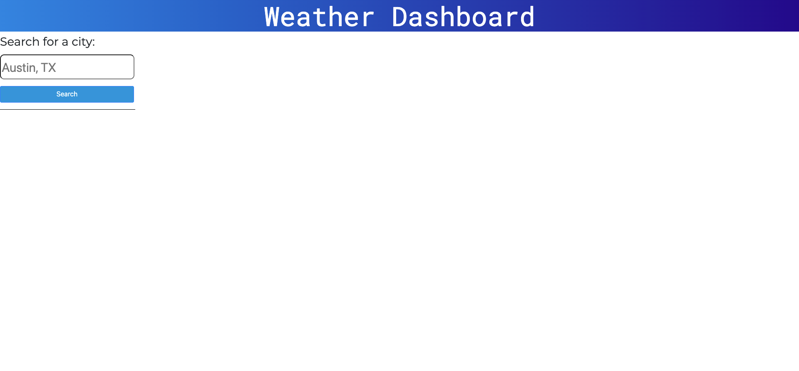

# Weather Dashboard

## Description
An app that lets you search for any city in the United States and see current weather conditions and a 5-day weather forecast for that city, and saves any city you search for, so you can go back and look at it later!

## Usage 
[Deployed Link!](https://jayladenae.github.io/06-homework/)
- When first visiting this Weather Dashboard you will see a search bar on the right hand of the screen, in that search bar type any city thats in the US to see current and future weather conditions!
- Your searches automatically save under that search bar, so you can click the previous city you searched for and those weather conditions will re-populate!

### Credits
Ismeny Saguillan - peer

### License

